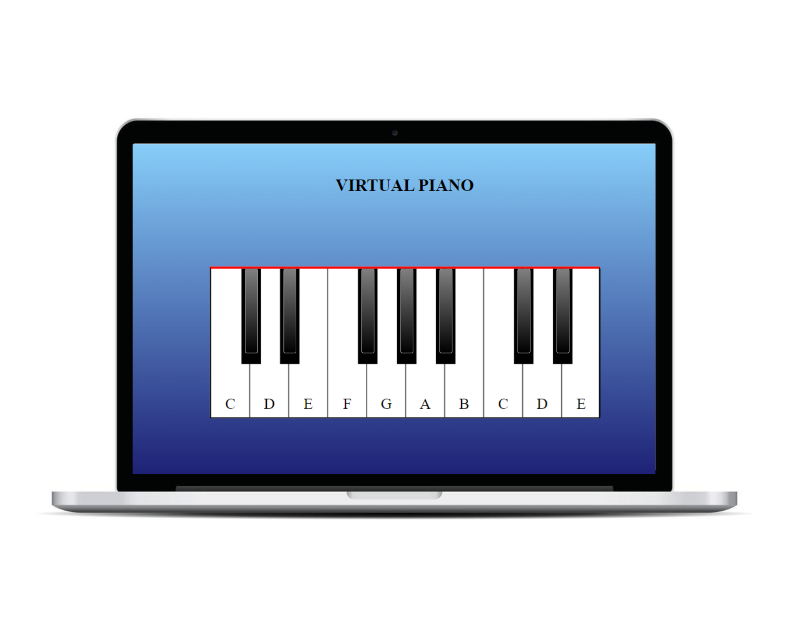

# Piano Virtual

## Descrição

Este projeto é um piano virtual de 17 teclas que permite aos usuários tocar notas musicais usando o mouse ou as teclas do teclado. Cada tecla do teclado está associada a uma nota específica, proporcionando uma experiência interativa e divertida.

## Tecnologias Utilizadas

- HTML
- CSS
- JavaScript

## Como Executar

1. Clone o repositório para o seu computador utilizando o seguinte comando.
2. Abra o arquivo `index.html` em um navegador web.

## Funcionalidades

- Toque notas musicais clicando nas teclas do piano virtual com o mouse.
- Utilize as seguintes teclas do teclado para tocar as notas: A, W, S, E, D, F, T, G, Y, H, U, J, K, O, L, P, Ç.

## Contribuindo

Se você deseja contribuir com este projeto, por favor, faça um fork do repositório e envie um pull request com suas alterações.

